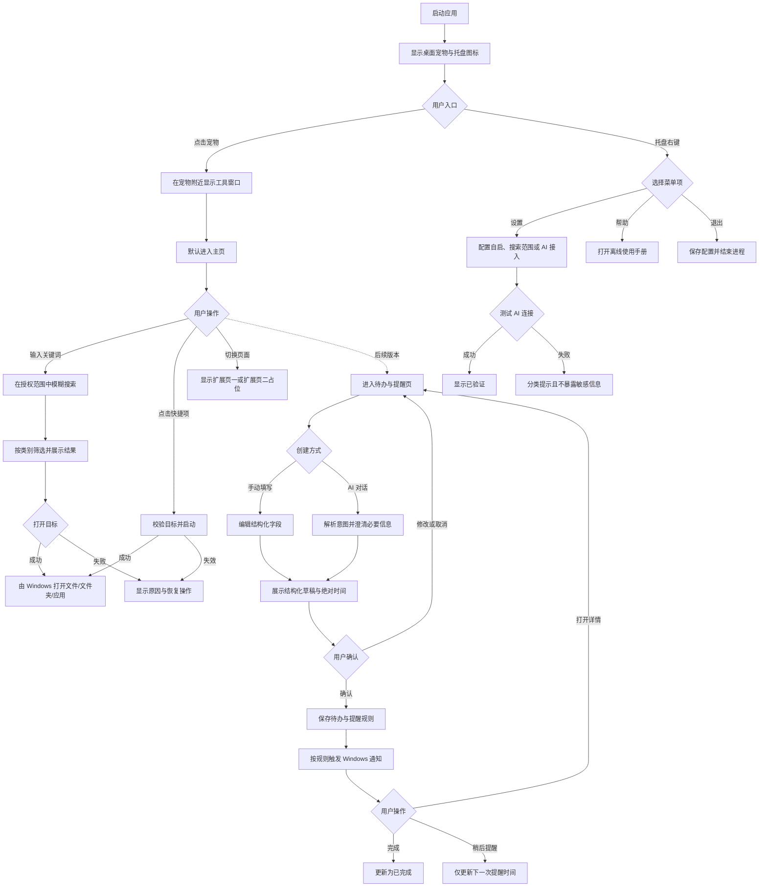

# Windows 桌面宠物产品需求文档（PRD）

| 文档属性 | 内容 |
| :--- | :--- |
| 文档版本 | V1.2（0.8.0 待办与提醒实现基线） |
| 产品平台 | Windows 桌面端 |
| 文档状态 | 已冻结；0.8.0 实现与验收基线 |
| 需求来源 | 用户本次产品想法；`需求文档.md` 仅作为背景素材参考 |
| 版本范围 | 桌面宠物入口、工具窗口主页、快捷启动、本地搜索、托盘与自启、帮助、AI 接入配置、待办与一次性提醒、AI 一句话结构化草稿，以及一个扩展占位页 |

> 文档约定：标记为“当前方案假设”的内容用于形成可执行方案，不代表已获最终确认；标记为“待产品确认”的内容需在开发排期或外部依赖接入前确认；标记为“不在首版范围”的内容不进入本次 MVP 验收。

### 1. 项目背景

#### 1.1 业务背景与问题

Windows 用户在日常使用中，需要在桌面、开始菜单、资源管理器和多个应用之间频繁切换，以完成查找文件、启动应用、打开常用资料等操作。传统桌面宠物偏重陪伴，但对效率场景帮助有限；传统启动器又缺少持续可见、轻量且有情感辨识度的入口。

本项目拟将“桌面宠物”作为常驻入口：用户点击宠物即可唤出工具窗口，在同一界面完成模糊搜索、分类筛选和快捷启动；同时通过系统托盘提供设置、自启、帮助与退出能力，并在设置中提供 AI 接入配置，为后续 AI 功能扩展建立安全的连接基础。

#### 1.2 产品目标

1. 提供稳定、易发现的桌面入口，让用户以一次点击进入常用工具。
2. 缩短“想到目标文件或应用”到“成功打开”的操作路径。
3. 支持用户维护个性化快捷入口，并对失效目标给出可恢复处理。
4. 提供可控的后台常驻、开机自启和帮助入口，降低首次使用与故障处理成本。
5. 在不泄露凭据的前提下完成 AI 接入配置与连接验证，为后续 AI 业务能力预留基础。
6. 提供与主页同级的待办与提醒页面，支持本地手动维护及 AI 一句话生成结构化草稿；另一个页面继续保留未定义扩展能力。

#### 1.3 成功指标

由于当前缺少用户规模、发布渠道和历史基线，以下分为“发布质量门槛”和“建议观察指标”。前者用于版本验收，后者仅为待产品确认的业务目标，不能视为既定承诺。

| 指标类型 | 指标 | 口径 | MVP 目标/状态 |
| :--- | :--- | :--- | :--- |
| 发布质量门槛 | 核心任务成功率 | 测试用户完成“唤出工具窗并打开目标”“创建并使用快捷项”“打开帮助”“设置自启”“保存并测试 AI 配置”各任务的成功人数占比 | 每项 ≥ 95% |
| 发布质量门槛 | 无崩溃会话率 | 未发生进程异常退出的会话数 ÷ 总会话数 | ≥ 99.5%（灰度期） |
| 发布质量门槛 | 搜索首屏响应 | 在验收数据集、搜索范围状态为“可用”时，从触发查询到首屏结果可交互的耗时 P95 | ≤ 1 秒 |
| 建议观察 | 搜索打开率 | 有搜索结果打开行为的搜索会话 ÷ 有有效输入的搜索会话 | 待基线建立后确认；建议首月观察值 ≥ 60% |
| 建议观察 | 快捷启动采用率 | 7 日内至少添加并成功启动 1 个快捷项的激活用户 ÷ 激活用户 | 待产品确认 |
| 建议观察 | AI 配置有效率 | AI 连接测试成功的设备数 ÷ 发起测试的设备数；不上传 Key | 待供应商与埋点合规方案确认 |
| 建议观察 | 7 日留存 | 首次激活后第 7 日仍有有效会话的设备数 ÷ 首次激活设备数 | 待发布渠道和隐私方案确认 |
| 后续版本观察 | AI 待办草稿确认率 | 用户确认创建的 AI 结构化草稿数 ÷ AI 成功生成的待办草稿数；不采集对话原文 | 待“待办与提醒”版本上线后建立基线 |
| 后续版本观察 | 提醒送达成功率 | 在产品承诺支持的运行条件内，成功投递的提醒数 ÷ 应投递提醒数 | 目标与运行条件待通知技术方案确认 |

#### 1.4 当前方案假设

1. MVP 面向 Windows 10/11 的普通桌面用户；具体最低系统版本、架构和安装方式由技术评审确认。
2. 软件面向单机、单 Windows 账户使用，配置按系统账户隔离，不提供登录和云同步。
3. 首版 AI 能力仅包括配置、凭据安全保存和连接测试，不包含 AI 对话、生成内容或自动操作文件。
4. AI 供应商、默认服务地址、模型与鉴权规范尚未确定；产品界面需能够根据最终适配清单展示必要字段，但不得承诺“任意兼容服务均可接入”。
5. 本地搜索只覆盖用户明确授权的文件夹及系统可识别的应用入口，不默认扫描全部磁盘，也不承诺实时全盘索引。
6. 使用手册随安装包提供离线版本，由系统默认处理程序打开；在线手册或离线失败后的在线兜底属于待确认方案。
7. 开机自启默认关闭，需用户主动开启；自启发生在该 Windows 账户登录后，不要求系统启动前运行。
8. MVP 视觉素材已确定为 RGS 8-Direction Characters（CC0-1.0），内置 `hero`、`base`、`skeleton`、`monster` 四个预设形象；复杂养成、换装、声音与角色商城仍不在首版范围。
9. “扩展页一”已在 0.8.0 演进为待办与提醒页面，支持手动创建以及通过 AI 生成结构化草稿；AI 只负责理解与辅助填写，任何创建、修改或删除均需用户确认后才写入本地数据。

#### 1.5 术语

| 术语 | 定义 |
| :--- | :--- |
| 桌面宠物 | 常驻桌面的可视化入口，用户点击后唤出工具窗口。 |
| 工具窗口 | 锚定在宠物附近的功能面板，包含主页及两个同级扩展占位页。 |
| 快捷项 | 用户添加的应用或文件入口，包含目标地址、显示名称、描述和图标信息。 |
| 搜索范围 | 经用户授权、允许本产品读取名称与路径元数据的文件夹集合，以及系统可识别的应用入口集合。 |
| 模糊搜索 | 基于目标名称关键词的包含、前缀或近似匹配；首版不等同于文件内容全文检索。 |
| AI 接入配置 | 连接指定 AI 服务所需的服务类型、Key 以及适配器要求的其他字段。 |
| 连接测试 | 使用不包含用户业务数据的最小请求验证配置可达性和鉴权状态。 |
| 待办 | 用户计划完成的事项，至少包含标题和完成状态，可选包含备注、截止时间与提醒规则。 |
| 提醒 | 在指定时间向用户发出通知的规则；提醒触发不等同于待办完成。 |
| 结构化草稿 | AI 根据对话解析出的待办候选数据，展示标题、日期时间、重复规则等字段；在用户确认前不形成正式待办或提醒。 |
| 激活用户 | 首次启动后至少成功完成一次主页搜索打开或快捷启动的设备用户。 |

#### 1.6 范围与非范围

**MVP 范围**

- Windows 桌面宠物的显示、点击交互和工具窗口定位。
- 工具窗口主页、两个同级扩展占位页及页面导航。
- 名称模糊搜索、结果分类筛选、结果打开和基础错误反馈。
- 应用或文件快捷项的添加、显示、编辑、删除、排序与启动。
- 托盘常驻、设置、显示/隐藏、帮助、开机自启、退出。
- AI Key 等必要配置的填写、掩码展示、安全存储、清除和连接测试。
- 待办列表、手动创建与维护、一次性提醒、运行中页内/托盘提醒和重启后的单次补发。
- 使用已保存 AI 配置解析一句自然语言，展示可编辑结构化草稿并在用户确认后写入。
- 搜索范围授权、配置本地持久化、基础诊断日志与使用手册。

**不在首版范围**

- 无限制通用 AI 对话、文本/图片生成、AI Agent、未经确认自动执行系统操作。
- 重复提醒、同一待办多次提醒、应用完全退出后的系统后台唤起和云同步。
- 将第二个扩展页预先定义为 AI、养成、换装或其他具体业务功能。
- 文件内容全文检索、OCR、语义向量搜索、网络文件与云盘内容搜索。
- 未经用户确认的全盘扫描、对所有磁盘变更的实时索引承诺。
- 文件重命名、移动、复制、删除、批量管理等写操作。
- 账户体系、多设备同步、团队协作、云端备份。
- 宠物喂养、等级、换装、语音、复杂动画或角色商城。
- 在线更新、插件市场、多语言和非 Windows 平台适配。

#### 1.7 数据、权限与非功能性需求

**数据与权限**

- 本地保存：基础设置、窗口/宠物位置、快捷项、用户授权的搜索范围、必要的搜索元数据缓存和 AI 配置状态。
- AI Key 必须存入受当前 Windows 账户保护的安全凭据存储；普通配置文件、日志、崩溃报告和埋点中不得出现可还原的 Key 明文。
- 保存后的 Key 在界面中仅显示掩码和“已配置/未配置”状态；用户可替换或清除。清除后凭据存储中不得保留可继续使用的旧 Key。
- 搜索仅访问用户授权范围；新增范围前展示路径及用途，撤销范围后停止搜索并允许清除对应缓存。
- 搜索查询词、完整文件路径和自定义描述默认不上报；如未来需要上传，必须另行完成隐私评审、告知并取得同意。
- 启动文件和应用沿用当前 Windows 用户权限；产品不得通过自身静默提权绕过系统权限或安全提示。
- 删除快捷项只删除本产品中的引用，不得删除、移动或修改目标文件。
- 后续待办数据默认按当前 Windows 账户本地保存；标题、备注、截止时间、提醒规则、完成状态及必要的通知投递状态均视为用户私有数据，不得默认上传。
- 用户选择 AI 对话创建待办时，只向已配置的 AI 服务发送完成本次解析所必需的对话内容；不得附带文件路径、搜索历史、快捷项或其他本地数据。发送前需通过隐私说明明确数据接收方，手动创建始终可用作无 AI 的替代路径。
- AI 生成内容只作为结构化草稿。产品不得因模型推断结果自动创建、修改、完成或删除待办，也不得在用户未确认的时间设置提醒。
- 提醒功能需使用 Windows 支持的通知能力；通知权限、应用未运行、系统休眠、时区/系统时间变更等条件下的送达语义，必须在该后续版本的技术方案与使用手册中明确。

**性能与稳定性**

- 宠物、托盘和搜索不得造成主界面长时间无响应；耗时扫描或查询需可异步执行并展示状态。
- 在约定验收设备与 20,000 条名称/路径元数据的可用搜索范围内，搜索首屏结果可交互耗时 P95 ≤ 1 秒；验收设备规格需在测试计划中固定。
- 工具窗口从点击宠物到主体可交互耗时 P95 ≤ 300 毫秒；冷启动性能另行记录，不混入口径。
- 空闲资源上限需在技术验证后锁定；在锁定前不得沿用参考资料中的具体 CPU/内存数字作为承诺。
- Explorer 重启、显示器切换或短暂网络异常不应导致本地配置丢失；托盘恢复能力进入兼容性测试。

**兼容性与可用性**

- 支持多显示器、不同缩放比例和任务栏位置；工具窗口不得完全超出当前显示器工作区。
- 关键操作可通过鼠标完成；搜索输入、结果选择、页面切换和关闭窗口需具备基础键盘路径。
- 图标、文本和选中态需可辨识；颜色不作为错误或状态的唯一表达方式。
- 所有外部失败均提供用户可理解的错误原因与下一步，不直接展示未经处理的堆栈、响应体或系统异常。

**埋点建议与隐私边界**

| 事件 | 触发时机 | 允许字段 | 禁止字段 |
| :--- | :--- | :--- | :--- |
| pet_tool_open | 工具窗口成功显示 | 来源、耗时区间、版本 | 屏幕内容、文件路径 |
| search_submit | 一次有效查询触发 | 查询长度区间、筛选类别、结果数量区间、耗时 | 查询原文、结果名称、完整路径 |
| search_result_open | 结果成功/失败打开 | 类别、结果序号区间、错误码 | 文件名、完整路径 |
| shortcut_action | 添加、编辑、删除或启动快捷项 | 动作、目标类别、结果、错误码 | 目标地址、自定义描述 |
| ai_connection_test | 连接测试完成 | 服务类型标识、结果码、耗时区间 | Key、请求/响应正文、Base URL 查询参数 |
| autostart_change | 自启状态修改完成 | 目标状态、结果码 | 系统账户信息 |
| help_open | 使用手册打开完成 | 本地/在线、结果码 | 本地绝对路径 |
| todo_action（后续） | 创建、修改、完成、删除或恢复待办 | 动作、入口（手动/AI）、结果码、是否含提醒 | 标题、备注、具体提醒时间、对话原文 |
| ai_todo_parse（后续） | AI 解析或澄清结束 | 结果码、澄清轮数区间、是否被确认、耗时区间 | 对话原文、结构化草稿内容、Key |
| reminder_delivery（后续） | 提醒应触发及用户响应 | 投递结果码、延迟区间、操作类型 | 待办内容、具体触发时间、系统账户信息 |

> 待产品确认：是否启用远程埋点、数据接收方、用户同意机制和保留周期。在确认前仅允许开发调试所需的本地匿名统计，且用户可清理。

### 2. 用户画像

#### 2.1 核心用户

| 维度 | 描述 |
| :--- | :--- |
| 用户类型 | 经常使用 Windows 处理学习、办公或创作任务的个人用户。 |
| 基本特征 | 假设以学生、知识工作者、内容创作者和多应用使用者为主；年龄、地域和行业分布尚无调研结论。 |
| 行为特征 | 桌面存在较多文件或应用；频繁在资源管理器、开始菜单和桌面快捷方式之间切换；愿意配置少量常用入口。 |
| 核心痛点 | 文件与应用入口分散；临时寻找目标步骤多；传统桌面宠物实用性不足；AI Key 配置和故障定位门槛较高。 |
| 主要期望 | 点击即用、搜索反馈快、快捷项可个性化、常驻但不打扰、配置安全且错误说明清楚。 |
| 主要顾虑 | 后台占用资源、扫描隐私文件、Key 泄露、开机自启不可控、宠物/工具窗遮挡内容、搜索结果不准确。 |

#### 2.2 次要用户

具备自有 AI Key、希望提前配置后续 AI 能力的进阶个人用户。他们关注服务兼容性、连接状态、凭据安全与可清除性，但首版不以 AI 对话效果作为核心价值验证指标。后续用户还包括希望快速记录事务、容易遗漏时间节点，并倾向用自然语言代替逐字段填写的个人效率用户。

#### 2.3 典型场景

1. **快速找文件**：用户点击宠物，直接输入名称片段，在“文档”筛选下定位并打开目标文件。
2. **快速启动应用**：用户把高频应用加入快捷栏，后续点击宠物并单击图标即可启动。
3. **维护快捷项**：目标名称或视觉风格不易识别时，用户修改图标和描述；目标失效时可重新定位或移除。
4. **后台常驻与自启**：用户关闭工具窗口后应用继续驻留托盘；主动开启自启后，下次登录 Windows 可再次使用。
5. **获得帮助**：用户不了解搜索范围或 AI 配置时，从托盘右键菜单打开使用手册。
6. **配置 AI 服务**：用户在设置中填写必要信息、测试连接，通过后保存；失败时保留输入并根据分类提示修正配置。
7. **浏览扩展入口**：用户切换到两个预留页时看到稳定的占位状态，能够返回主页，不误以为功能已上线。
8. **手动管理待办（后续）**：用户在待办与提醒页新增事项、设置截止时间或提醒，并在列表中完成、编辑、稍后提醒或删除。
9. **AI 对话创建待办（后续）**：用户输入“明天下午 3 点提醒我提交周报”，AI 将意图解析为结构化草稿；用户核对标题、绝对日期时间和提醒规则后确认创建。
10. **AI 澄清歧义（后续）**：当用户只说“下午提醒我开会”或给出已过去时间，AI 询问缺失信息或提示修正，不自行猜测并落库。

#### 2.4 信息架构

| 一级入口 | 二级页面/操作 | 核心内容 |
| :--- | :--- | :--- |
| 桌面宠物 | 工具窗口 | 点击唤出或收起，窗口锚定宠物并保持在可视工作区内。 |
| 工具窗口 | 主页 | 搜索输入、快捷启动栏、类别筛选、搜索结果。 |
| 工具窗口 | 待办与提醒 | 同级导航页面，包含日期筛选列表、手动编辑、AI 一句话入口、结构化确认和页内提醒操作。 |
| 工具窗口 | 扩展页二 | 同级导航占位，显示“功能规划中”与返回主页路径。 |
| 系统托盘 | 显示/隐藏、设置、开机自启、帮助、退出 | 全局控制与故障入口。 |
| 设置 | 常规设置 | 开机自启、搜索范围等。 |
| 设置 | AI 接入 | 服务配置、Key、安全保存、连接测试、清除。 |
| 设置 | 通知设置（后续） | 通知权限状态、默认提醒行为、稍后提醒选项及必要的提醒诊断。 |
| 使用手册 | 离线文档 | 首次使用、主页、搜索范围、快捷项、AI 配置、自启与常见问题。 |

#### 2.5 用户核心路径

- 搜索路径：点击宠物 → 工具窗口主页 → 输入关键词 → 选择类别 → 选择结果 → 打开目标。
- 快捷路径：点击宠物 → 选择快捷项 → 启动目标。
- 配置路径：托盘右键 → 设置 → AI 接入 → 填写 → 测试连接 → 通过后保存。
- 求助路径：托盘右键 → 帮助 → 打开使用手册 → 查找对应说明。
- 手动待办路径：点击宠物 → 待办 → 新建 → 填写标题/时间/提醒 → 确认保存。
- AI 待办路径：点击宠物 → 待办 → 输入一句话 → 必要时补充信息 → 检查结构化草稿 → 确认执行。
- 提醒处理路径：页内/托盘提醒触发 → 打开待办页 → 完成/10 分钟后提醒/打开详情 → 更新待办状态或下一次提醒时间。

### 3. 功能需求列表

#### 3.1 功能清单

| 功能模块 | 功能点 | 优先级 | 详细描述 |
| :--- | :--- | :--- | :--- |
| 桌面宠物 | PET-01 宠物常驻入口 | P0 | 应用运行时显示可点击的 RGS 宠物入口；宠物不因工具窗口收起而退出。透明点击区域需与可见主体保持一致。 |
| 桌面宠物 | PET-02 拖动与位置记忆 | P1 | 用户可拖动宠物，位置按 Windows 账户保存；只有超过明确移动阈值才进入拖动，避免轻微手抖吞掉单击；显示器配置变化后自动修正到可视工作区。 |
| 桌面宠物 | PET-03 预设形象与动画 | P1 | 内置 RGS 的四个 CC0 角色预设并立即应用；支持空闲、单击/双击/拖动动作。鼠标离开近距交互半径后回到正面姿态；空闲时低频随机触发短语、动作或工作区内短距离漫游，鼠标靠近、拖动或打开工具窗时必须立即中断。运行时只展示正面和左右侧面，不展示背对用户的上方向帧；复杂皮肤、养成、声音或商城另行定义。 |
| 工具窗口 | WIN-01 点击唤出与收起 | P0 | 单击宠物在其上方优先弹出工具窗口；再次单击宠物、点击窗口外或按 Esc 收起。双击仅触发宠物动作，不得闪出或切换工具窗口。收起不退出应用。 |
| 工具窗口 | WIN-02 自适应定位 | P0 | 以宠物可见角色为锚点，优先在上方、空间不足时在下方打开；不得覆盖角色。可用高度不足时缩短可滚动窗口，保证主体位于宠物当前显示器工作区；适配多显示器和缩放。 |
| 工具窗口 | WIN-03 常驻与置顶 | P0 | 标题栏提供“常驻工具窗口”和“保持窗口置顶”两个独立状态按钮。常驻仅阻止失焦自动收起，不阻止关闭按钮、Esc 或再次点击宠物；置顶仅控制窗口层级。两项按账户保存并具有不依赖颜色的选中提示。 |
| 页面导航 | NAV-01 默认主页 | P0 | 工具窗口每次从隐藏变为显示时默认进入主页；主页导航具有明确选中态。 |
| 页面导航 | NAV-02 两个同级预留页 | P0 | 提供“扩展页一”“扩展页二”中性占位入口，与主页同级；MVP 仅展示规划中状态。扩展页一的后续候选方向为待办与提醒，但首版不得展示尚不可用的创建或提醒入口。 |
| 页面导航 | NAV-03 页面扩展配置 | P2 | 后续可按独立需求替换名称、图标和内容；优先允许将扩展页一替换为待办与提醒页，不属于首版用户可配置项。 |
| 主页搜索 | SRCH-01 模糊搜索输入 | P0 | 主页顶部提供单行输入框，递归查询授权范围内的文件、文件夹和应用名称；有效输入后延迟触发。设置页可分别开启 `*`/`?` 通配符和以 `re:` 开头的正则表达式；关闭时特殊字符按普通文字处理。首版不读取文件正文。 |
| 主页搜索 | SRCH-02 搜索范围管理 | P0 | 搜索框左侧提供“全部范围、仅应用、单个授权目录”选择；设置页可添加、撤销用户授权文件夹并展示状态。不默认开启全盘扫描；递归扫描只发生在明确授权范围内。 |
| 主页搜索 | SRCH-03 类别筛选 | P0 | 提供“全部、文件夹、文档、应用、图片、视频、音频”筛选；分类依据扩展名、对象类型和系统识别信息；无法可靠归类的对象仅进入“全部/其他”。 |
| 主页搜索 | SRCH-04 结果展示与打开 | P0 | 结果区显示类型图标、名称、路径或位置；支持鼠标选择与双击打开，键盘选择后按 Enter 打开；文件夹由资源管理器打开，文件/应用由系统默认方式打开。 |
| 主页搜索 | SRCH-05 搜索状态与错误 | P0 | 覆盖初始引导、输入为空、搜索中、无结果、范围准备中、范围无权限、目标失效、打开失败；失败不得清空用户输入或使界面失去响应。 |
| 主页搜索 | SRCH-06 结果排序 | P1 | 综合匹配程度、名称前缀、目标类型等排序；精确算法和可调权重待后续数据验证。 |
| 主页搜索 | SRCH-07 文件内容搜索 | P2 | 对文档正文、OCR 或语义内容进行检索，需单独评估隐私与性能。 |
| 快捷启动 | QCK-01 快捷栏展示 | P0 | 位于搜索框下方，以图标行展示应用或文件快捷项；空间不足时可滚动或展开，不能挤压到不可操作。 |
| 快捷启动 | QCK-02 添加快捷项 | P0 | 通过明确的“添加”入口选择应用或文件；默认读取目标的系统图标，并用目标名称作为显示名称和默认描述。取消选择不产生空记录，重复目标需提示并允许取消或继续添加。 |
| 快捷启动 | QCK-03 自定义图标与描述 | P0 | 添加或编辑时可替换为支持格式的本地图片并修改名称/描述；支持格式与尺寸待 UI/技术评审，读取失败时回退默认图标。描述以 Tooltip 或可读区域呈现。 |
| 快捷启动 | QCK-04 编辑、删除与排序 | P0 | 支持编辑、移除和调整顺序；移除仅删除快捷引用，操作成功后立即持久化。排序交互形式由设计确定。 |
| 快捷启动 | QCK-05 启动与失效处理 | P0 | 单击快捷项启动目标；目标不存在、无权限或启动失败时显示错误并提供编辑定位或移除入口，不自动删除。 |
| 快捷启动 | QCK-06 拖放添加 | P1 | 支持将应用或文件拖入快捷栏添加，规则与选择器添加一致。 |
| 系统托盘 | TRAY-01 托盘常驻 | P0 | 应用启动后创建托盘图标；收起工具窗口不移除托盘。Explorer 重启后的恢复纳入兼容性测试。 |
| 系统托盘 | TRAY-02 右键菜单 | P0 | 至少包含“显示/隐藏桌宠、显示/收起工具窗口、设置、开机自启、帮助、退出”；状态与实际同步。宠物右键可隐藏自身；隐藏后双击托盘图标或选择“显示桌宠”必须恢复。 |
| 系统托盘 | TRAY-03 安全退出 | P0 | 仅用户选择“退出”或确认系统结束时终止进程；退出前保存必要配置并停止后台任务，不遗留不可恢复的临时状态。 |
| 开机自启 | AUTO-01 启用与关闭 | P0 | 用户可在设置或托盘菜单切换自启，默认关闭；两处开关实时同步。仅对当前 Windows 账户生效，不静默请求管理员权限。 |
| 开机自启 | AUTO-02 失败回滚 | P0 | 权限、系统策略或写入失败时，开关恢复实际状态并显示可操作提示；不得显示“已开启”但实际未生效。 |
| 帮助 | HELP-01 打开使用手册 | P0 | 托盘右键“帮助”使用系统默认处理程序打开随安装包提供的离线手册；重复点击不产生失控窗口。 |
| 帮助 | HELP-02 手册失败处理 | P0 | 手册缺失、无关联程序或打开失败时显示错误与手册位置；在线兜底仅在确认网址和网络策略后加入。 |
| 帮助 | HELP-03 使用手册内容 | P0 | 至少覆盖安装/启动、宠物与工具窗、搜索范围、快捷项、AI 配置、自启、退出、隐私说明和常见错误。 |
| 设置 | SET-01 设置入口与保存 | P0 | 托盘菜单可打开单实例设置窗口；设置按字段校验，保存成功反馈明确，关闭未保存修改时需提示。 |
| AI 接入 | AI-01 配置录入 | P0 | 设置中提供服务类型和 API Key；如最终适配器必须使用服务地址、模型等字段，则按所选服务展示并校验。Key 输入默认掩码，可替换和清除。 |
| AI 接入 | AI-02 安全存储 | P0 | Key 使用受当前 Windows 账户保护的安全存储；普通配置只保存非敏感项和凭据引用/状态。日志、埋点、错误提示不得输出 Key。 |
| AI 接入 | AI-03 保存与连接测试 | P0 | 字段完整后允许测试连接；当前供应商、服务地址、模型和 Key 全部测试通过后才允许保存。测试失败、超时或测试期间修改字段时保留输入并禁止保存，不覆盖上一份已保存配置。测试期间防止重复提交并可超时结束。 |
| AI 接入 | AI-04 错误分类与恢复 | P0 | 区分必填缺失、Key 无效/鉴权失败、无权限、限流、服务地址/模型错误、网络不可达、超时及未知错误；保留非敏感输入并给出修正建议。 |
| AI 接入 | AI-05 AI 对话能力 | P2 | 后续版本优先支持面向待办与提醒的任务型对话，使用已配置服务将自然语言解析为结构化草稿；不默认扩展为无限制通用聊天，需同步定义内容安全、计费提示、数据处理和失败回退。 |
| 待办与提醒 | TODO-01 页面与列表 | P1 | 将扩展页一演进为待办与提醒页，至少提供“待处理、已完成”状态及按日期查看能力；显示标题、截止/提醒时间、重复状态和完成状态，并具有空状态与新建入口。 |
| 待办与提醒 | TODO-02 手动创建与维护 | P1 | 支持手动创建、查看、编辑、完成、恢复和删除待办；标题必填，备注、截止时间、提醒时间和重复规则可选。删除前需确认，并区分“删除待办”与“仅取消提醒”。 |
| 待办与提醒 | TODO-03 提醒规则 | P1 | 0.8.0 支持一次性提醒；每日、每周、工作日、自定义重复及多次提醒留到后续范围。不得保存无效或不可解释的时间规则，时区默认跟随 Windows 当前时区并明确展示绝对日期时间。 |
| 待办与提醒 | TODO-04 通知与用户操作 | P1 | 到期时同时生成页内提醒并提交 Windows 托盘气泡，页面提供“完成、10 分钟后提醒、打开详情”；应用退出时不承诺准点提醒，重启后对未投递的一次性提醒补发一次。 |
| 待办与提醒 | TODO-05 AI 对话解析 | P1 | 用户可用自然语言描述事项、日期时间、重复规则和备注；AI 返回结构化草稿。信息缺失、相互冲突或有多种合理解释时，优先追问影响创建结果的最少必要字段，不得静默猜测。 |
| 待办与提醒 | TODO-06 草稿确认与写入 | P1 | 在独立确认卡中展示 AI 解析的标题、截止时间、提醒时间、重复规则、备注及当前时区；用户可修改、确认或取消。仅确认后写入本地，并提供创建成功反馈和撤销入口。 |
| 待办与提醒 | TODO-07 对话式修改 | P1 | 支持通过 AI 发起修改、完成、稍后提醒或删除意图，但必须先明确唯一目标并展示变更前后差异；用户再次确认后才执行，存在多个同名待办时要求用户选择。 |
| 待办与提醒 | TODO-08 AI 降级与隐私 | P1 | 未配置 AI、连接失败、超时、限流或解析失败时保留用户输入并提供重试及“转为手动填写”；只发送本次解析所需内容，不发送其他本地上下文；本版不落盘保存对话，用户可随时清除内存内容。 |
| 本地数据 | DATA-01 配置持久化 | P0 | 快捷项、排序、搜索范围、普通设置和窗口位置等按账户保存；异常写入不得破坏上一份可用配置。 |
| 本地数据 | DATA-02 清理与重置 | P1 | 提供清除搜索缓存、重置设置和卸载时保留/清理数据的明确选择。 |

#### 3.2 关键交互与边界规则

**工具窗口**

1. 同一时刻只存在一个工具窗口实例；连续点击不得生成多个窗口。
2. 工具窗口优先位于宠物上方并与宠物保持视觉关联；空间不足时以“完整可见、可操作”为最高优先级。
3. 从隐藏状态唤出时聚焦搜索框；若该行为与无障碍或输入法冲突，可由测试结果调整，但必须保留明确焦点。
4. 切换预留页不会启动后台业务；再次打开工具窗口返回主页。
5. 工具气泡采用浅色奶油米白背景与低饱和暖橙强调色；按钮、输入框、下拉框和卡片使用统一圆角与间距。主要输入和图标按钮目标不小于 44×44 像素，键盘焦点清晰可见；卡片悬停反馈不得改变布局，并应遵循 Windows 动画偏好。
6. 开启常驻后，点击窗口外部不自动收起；关闭按钮、Esc、再次点击宠物仍立即收起。置顶开关不改变常驻状态，两项重启后保持。

**搜索**

1. 建议在用户停止输入 300 毫秒后触发查询；该数值是交互初值，可在性能测试后调整，不作为技术实现限定。
2. 空输入时展示搜索范围引导或空状态；“最近文件”未获确认，首版不读取系统最近记录。
3. 类别筛选只改变结果集合，不清空关键词；切换类别时保持当前查询上下文。
4. 若搜索范围仍在准备中，可展示已可用的部分结果，同时明确范围状态；用户可继续使用快捷栏和导航。
5. 文件类型映射由产品提供可维护规则表；未知扩展名不应被误标为已知类别。
6. 搜索结果默认只读，任何打开动作均由 Windows 权限与默认程序规则处理。

**快捷项**

1. 添加界面必须在保存前预览默认名称和图标，并允许修改描述。
2. 自定义图标文件后续被移动或删除时，产品可使用已保存的本地图标副本或回退目标默认图标；具体方案由隐私和磁盘占用评审确认。
3. 若目标移动或删除，快捷项进入“失效”态；用户可以重新选择目标或移除引用。
4. 对可能触发系统安全提示的目标，产品不得承诺静默启动或绕过提示。

**AI 配置**

1. “保存”依赖当前配置的连接测试结果：字段未完整或当前值未通过时必须禁用；通过后才可保存。
2. 修改服务类型、Key、服务地址或模型后，连接状态重置为“待测试”，立即禁用保存。
3. 测试连接只发送适配器要求的最小请求，不携带搜索词、路径、快捷项、描述或其他本地数据。
4. 错误提示只展示标准化错误类别、时间和建议；原始响应体、鉴权头和 Key 不进入界面、日志或埋点。
5. 连接测试设置明确超时；当前外层超时为 20 秒。
6. 测试失败或测试期间修改字段时保留全部输入，不持久化失败配置，也不覆盖上一份已保存配置。

**待办、提醒与 AI 对话（后续版本）**

1. 手动创建是基础能力，不依赖 AI 配置或网络；AI 对话是提高录入效率的可选入口，不得成为创建和管理待办的唯一路径。
2. 用户输入自然语言后，系统先生成结构化草稿。草稿必须以用户当前时区同时展示明确的绝对日期与时间；“明天”“下周一”等相对表述仅可作为辅助说明，不能作为唯一确认信息。
3. 标题缺失、时间缺失或歧义、提醒时间已过去或与截止时间关系不合理、重复规则冲突时，AI 应追问最少必要信息；若用户选择跳过，可转入手动表单，不得用未经确认的推测值创建。
4. 创建、修改、完成、恢复、稍后提醒和删除均属于数据写操作。AI 可提出变更草稿，但只有在明确目标、展示变更内容并获得用户确认后才能执行。
5. AI 对话涉及多个同名待办时，需展示可区分的候选项供用户选择；不得仅凭最近创建、列表顺序或模型猜测选择目标。
6. 待办完成与提醒触发相互独立：提醒触发不自动标记完成；完成待办后是否取消后续重复提醒需按清晰规则执行并给出反馈。
7. 一次性提醒触发后，用户可完成、稍后提醒或打开详情。稍后提醒生成新的下一次触发时间，但不应静默修改原截止时间。
8. 系统时区或时间发生变化时，日历型提醒按用户选择的本地时间规则重新计算；倒计时型提醒是否支持及语义需另行确认。任何调整均需在详情中可见。
9. 应用未运行、Windows 休眠或通知被系统禁用时，产品只能在已明确承诺的运行条件内计算送达成功率；恢复后的补发、过期丢弃或汇总策略必须在发布前形成规则并写入手册。
10. 对话请求只携带本次任务所需文本。默认不向 AI 服务发送已有待办列表；仅当用户主动引用待办进行修改且确认所选目标后，才发送完成本次操作所需的最少字段。

**托盘、自启与帮助**

1. 工具窗口收起与程序退出是不同动作；用户只有通过托盘“退出”等明确路径才结束常驻进程。
2. 自启设置变更后立即读取实际状态校验；校验失败则回滚界面状态。
3. 自启动成功后保持宠物和托盘可用；是否默认弹出工具窗口为“否”，避免登录后打扰。
4. 使用手册作为安装包交付物进行版本绑定；帮助入口不得指向未确认或可能失效的临时地址。

#### 3.3 状态与错误矩阵

| 对象 | 状态/异常 | 用户可见反馈 | 可恢复操作 |
| :--- | :--- | :--- | :--- |
| 搜索范围 | 未配置 | 提示添加搜索范围，不展示虚假结果 | 前往设置添加文件夹 |
| 搜索范围 | 准备中 | 展示进度或进行中状态，可展示部分结果 | 继续等待、取消该范围 |
| 搜索范围 | 无权限/路径失效 | 标出具体范围及标准化原因 | 重新授权、移除范围 |
| 搜索 | 无结果 | 保留关键词和类别，提示更换关键词/类别/范围 | 修改查询、切换“全部” |
| 结果/快捷项 | 目标不存在 | 标记失效，不自动删除 | 重新定位、移除引用 |
| 结果/快捷项 | 无权限/无默认程序 | 显示 Windows 权限或关联程序提示 | 调整权限、设置默认程序 |
| AI 配置 | 必填缺失/格式错误 | 字段就地提示，不发请求 | 补全或修正字段 |
| AI 连接 | 鉴权失败/无权限 | 区分 Key 无效与账户无权限（以服务返回能力为准） | 更换 Key、检查账户权限 |
| AI 连接 | 限流/超时/网络失败 | 显示类别和可重试建议，不暴露响应正文 | 稍后重试、检查网络 |
| AI 待办创建 | 未配置/连接失败/解析失败 | 保留用户输入，说明 AI 暂不可用 | 重试、前往配置、转为手动填写 |
| AI 待办草稿 | 信息缺失/时间歧义/目标不唯一 | 标记待确认字段，不创建或修改数据 | 回答澄清问题、选择目标、手动编辑 |
| 待办时间 | 提醒时间已过/早于允许边界/重复规则冲突 | 就地标出冲突并展示当前时区和绝对时间 | 修改时间、取消提醒、调整重复规则 |
| 提醒投递 | 通知权限关闭/系统能力不可用 | 页面和设置显示不可投递状态，不声称提醒已生效 | 打开系统设置、查看诊断、仅保留待办 |
| 提醒投递 | 应用未运行/休眠导致错过 | 按已确认策略显示“已错过”、补发或汇总，不重复轰炸 | 完成、稍后提醒、打开详情 |
| 自启 | 系统策略阻止 | 开关回滚到实际状态并说明原因 | 检查系统策略、保持关闭 |
| 帮助 | 文档缺失/打开失败 | 说明失败并显示安装内相对位置或修复建议 | 修复安装；在线兜底待确认 |
| 配置保存 | 磁盘/权限异常 | 说明未保存，保留当前编辑内容 | 重试、检查存储权限 |

#### 3.4 依赖、风险与待产品确认

| 类型 | 项目 | 影响 | 当前处理 |
| :--- | :--- | :--- | :--- |
| 待产品确认 | 首版 AI 供应商、协议、服务地址与模型 | 决定配置字段、测试方式、错误映射和使用手册 | 开发外部适配前必须确认；PRD 不预设具体厂商 |
| 待产品确认 | 搜索范围的首次引导与默认建议 | 影响开箱搜索可用性和隐私感知 | 默认不全盘扫描；建议让用户确认桌面/文档/下载等候选目录 |
| 待产品确认 | 应用入口来源与支持的目标类型 | 影响应用搜索覆盖率和兼容性 | 通过技术验证形成支持清单；脚本、URL、快捷方式参数不默认承诺 |
| 待产品确认 | 使用手册格式与在线兜底地址 | 影响安装包、更新和打开方式 | MVP 假设离线手册；在线方案确认后再纳入 |
| 待产品确认 | 远程埋点与隐私政策 | 影响业务指标可观测性和合规成本 | 未确认前不上传个人文件相关数据 |
| 待产品确认 | 宠物素材、品牌、拖动与动画范围 | 影响首屏体验和资源占用 | MVP 只锁定入口与点击交互；拖动 P1、复杂动画 P2 |
| 待产品确认 | 待办字段、列表分组及完成/删除语义 | 决定数据模型、页面结构和撤销策略 | 后续版本立项前冻结最小字段及状态机 |
| 待产品确认 | 提醒类型、重复规则、稍后提醒选项与错过处理 | 决定调度模型、通知交互和验收口径 | 优先验证一次性提醒；扩展规则按范围评审纳入 |
| 待产品确认 | AI 对话留存、隐私提示与供应商数据策略 | 决定是否保存会话、可清理范围和用户告知 | 默认不保留完整对话；接入前完成隐私与供应商条款评审 |
| 技术风险 | 应用退出、系统休眠、时区变化或通知权限限制 | 可能造成提醒延迟、错过或重复 | 技术选型需明确运行条件，建立时间变更与恢复测试矩阵 |
| AI 风险 | 模型误解事项、日期、重复规则或修改目标 | 可能创建错误提醒或修改错误数据 | 结构化草稿、绝对时间、目标选择和二次确认作为强制门槛 |
| 技术风险 | 不同 Windows 版本、缩放、多屏、Explorer 重启 | 可能造成窗口越界或托盘丢失 | 建立兼容性矩阵与异常恢复测试 |
| 技术风险 | 大目录准备耗时、磁盘变化和无权限路径 | 可能出现结果延迟或过期 | 状态可见、异步处理、允许撤销范围；不承诺全盘实时 |
| 安全风险 | Key 泄露到配置、日志、崩溃报告或界面 | 造成用户资产损失 | 受账户保护的安全存储、脱敏、日志检查与安全验收 |
| 体验风险 | 常驻、自启或窗口遮挡造成打扰 | 影响留存甚至引发卸载 | 自启默认关、弹窗按需出现、窗口收起与退出边界明确 |
| 交付风险 | 预留页或待办规划被误当成已上线功能 | 造成预期落差 | MVP 使用中性命名和“功能规划中”状态；仅在后续版本通过验收后改名并开放入口 |

### 4. 业务流程图

### 5. 验收标准

#### 5.1 P0 功能验收

- [ ] **AC-01（PET-01）**：给定应用已成功启动，当用户未打开工具窗口并持续观察 30 分钟，那么桌面宠物保持可见且可点击，工具窗口收起不会结束进程。
- [ ] **AC-02（PET-02、PET-03、WIN-01、WIN-02）**：给定宠物位于主屏、屏幕上边缘和副屏边缘三种位置，当用户轻微移动后单击宠物，那么 300 毫秒 P95 内出现唯一工具窗口且不误触拖动；当双击时只播放动作、不闪出窗口；工具窗口优先位于上方且主体不超出当前工作区。所有动作帧均不出现背向姿态；鼠标离开近距半径后宠物回到正面，空闲随机行为保持低频且可由鼠标靠近、拖动和工具窗唤出立即中断。
- [ ] **AC-03（NAV-01、NAV-02、WIN-03）**：给定工具窗口从隐藏变为显示，当此前停留在任一扩展页，那么本次显示进入主页；当依次切换页面各 20 次，页面选中态正确且无重复实例。开启常驻后失焦窗口保持，显式收起仍生效；切换置顶不改变常驻状态，两项重启后保持。
- [ ] **AC-04（SRCH-01）**：给定授权范围的深层子目录含“季度复盘.docx”和应用“复盘助手”，当输入名称片段“复盘”，那么一次延迟查询同时返回名称匹配项且界面不冻结；开启通配符后 `*.docx` 可匹配，开启正则后 `re:^季度` 可匹配，关闭对应开关时特殊字符按普通文字处理；搜索不读取文档正文。
- [ ] **AC-05（SRCH-02）**：给定用户尚未授权任何文件夹，当进入主页，那么范围选择器仍提供“全部范围、仅应用”且不启动全盘扫描；添加两个目录后可分别选择单个范围且结果不串范围；撤销后该目录及其缓存不再出现在搜索结果中。
- [ ] **AC-06（SRCH-03）**：给定验收范围各含文件夹、文档、应用、图片、视频、音频和未知类型各至少 2 个匹配项，当依次选择各类别，那么结果只包含对应类型，未知类型不误入已知类别，切回“全部”恢复完整集合且关键词不变。
- [ ] **AC-07（SRCH-04）**：给定结果列表含可访问的文件、文件夹和应用，当分别使用鼠标双击及键盘选择后按 Enter，那么三类目标均由 Windows 正确打开，且列表至少展示图标、名称和路径/位置。
- [ ] **AC-08（SRCH-05）**：给定空输入、无结果、范围准备中、无权限、目标失效和打开失败六种状态，当逐一触发，那么每种状态都有非技术化提示及至少一个可执行恢复动作，原关键词保留，页面仍可操作。
- [ ] **AC-09（QCK-01）**：给定快捷项数量分别为 0、1 和超过单行可见上限，当打开主页，那么快捷栏分别显示添加引导、单项和可访问的滚动/展开方式，不遮挡搜索结果的主要操作区。
- [ ] **AC-10（QCK-02）**：给定用户选择一个有效应用和一个有效文件，当分别完成添加且未自定义时，那么快捷栏使用目标系统图标，并以目标名称作为显示名称和默认描述生成两条记录；取消选择不生成记录，重复添加时出现提示且用户可取消。
- [ ] **AC-11（QCK-03）**：给定已有快捷项，当用户替换为受支持的本地图标并修改名称/描述后保存，那么主页立即显示新图标和名称、描述可被访问；当图标读取失败时回退默认图标并给出提示。
- [ ] **AC-12（QCK-04）**：给定至少 3 个快捷项，当用户编辑第 1 项、移除第 2 项并调整其余顺序后重启应用，那么修改与顺序保持；被移除快捷项的目标文件仍存在且内容未改变。
- [ ] **AC-13（QCK-05）**：给定一个有效快捷项和一个目标已删除的快捷项，当单击有效项时目标成功启动；当单击失效项时不崩溃、不自动删除记录，并显示“重新定位”和“移除”入口。
- [ ] **AC-14（TRAY-01、TRAY-02）**：给定应用正常运行，当从宠物右键菜单隐藏桌宠时，工具窗口同步收起而托盘仍存在；双击托盘或选择“显示桌宠”后宠物恢复。托盘菜单分别提供桌宠可见性、工具窗口、设置、自启、帮助和退出，状态与实际一致。
- [ ] **AC-15（TRAY-03）**：给定正在进行可安全终止的后台范围准备，当用户选择托盘“退出”，那么应用停止任务、保存可用配置并在 5 秒内结束进程；再次启动时上一份已保存配置可读取且无多余旧进程。
- [ ] **AC-16（AUTO-01、AUTO-02）**：给定自启初始关闭，当用户在设置中开启，那么托盘菜单同步为开启且重新登录该 Windows 账户后应用自动启动但不主动弹出工具窗口；当关闭后再次登录则不启动；模拟系统策略拒绝时两处开关均回滚为关闭并展示原因。
- [ ] **AC-17（HELP-01、HELP-02）**：给定安装包中的离线手册完整，当点击托盘“帮助”，那么系统默认处理程序在 3 秒内收到打开请求；给定手册缺失，当再次点击，那么应用保持运行并显示文档缺失与修复建议，不打开未确认网址。
- [ ] **AC-18（HELP-03）**：给定候选发布包，当检查离线手册，那么安装/启动、宠物与工具窗、搜索范围、快捷项、AI 配置、自启、退出、隐私说明和常见错误九类内容均可通过目录或搜索定位。
- [ ] **AC-19（SET-01）**：给定设置窗口已打开，当用户再次从托盘选择“设置”，那么不会产生第二实例；当字段不合法时保存被阻止并就地提示；当存在未保存修改并关闭时出现保存、放弃、取消三种选择。
- [ ] **AC-20（AI-01）**：给定用户进入 AI 接入设置，当输入 Key 时字符默认掩码；当切换已支持服务类型时只展示该服务所需字段并执行必填/格式校验；清除后界面变为“未配置”。
- [ ] **AC-21（AI-02）**：给定已保存一个测试 Key，当检查普通配置文件、诊断日志、埋点载荷和错误界面时，不存在完整 Key 或可直接还原的敏感值；换用另一 Windows 账户时不能读取该 Key；清除后原 Key 无法继续用于连接测试。
- [ ] **AC-22（AI-03）**：给定字段不完整或当前配置尚未通过测试，那么保存按钮禁用；填写完整后测试按钮可用且重复点击不产生并发请求。测试失败时输入保持且上一份配置不变；测试通过后保存可用，保存完成或修改任一字段后再次禁用。测试请求不包含本地查询词、路径或快捷项数据。
- [ ] **AC-23（AI-04）**：给定可控测试服务依次返回必填缺失、鉴权失败、无权限、限流、地址/模型错误、网络不可达、超时和未知错误，当执行连接测试，那么八类结果均映射为不同标准化提示并提供相应建议，界面与日志均不显示原始鉴权信息或响应正文。
- [ ] **AC-24（DATA-01）**：给定用户已修改普通设置、快捷项顺序和搜索范围，当正常重启应用，那么数据完整恢复；当模拟一次配置写入中断后再次启动，那么应用读取上一份可用配置或进入可解释的恢复状态，不以损坏文件覆盖可用备份。

#### 5.2 非功能性验收

- [ ] **AC-NFR-01 性能**：给定固定验收设备和含 20,000 条名称/路径元数据的可用范围，当执行不少于 200 次代表性查询，那么首屏结果可交互耗时 P95 ≤ 1 秒，工具窗口唤出耗时 P95 ≤ 300 毫秒，测试过程主界面可持续响应。
- [ ] **AC-NFR-02 稳定性**：给定灰度统计方案已完成隐私评审，当累计不少于 1,000 个有效会话，那么无崩溃会话率 ≥ 99.5%；若未启用远程统计，则以等量自动化/人工回归会话替代并记录口径。
- [ ] **AC-NFR-03 多屏兼容**：给定 Windows 10/11 兼容性矩阵中的设备，覆盖 100%、125%、150%、200% 缩放和至少两种多屏排列，当移动显示器主次关系并重新唤出窗口，那么宠物与工具窗口仍可见、可操作且无严重布局截断。
- [ ] **AC-NFR-04 权限与隐私**：给定用户未授权目录和已撤销目录，当使用文件名或路径特征查询，那么不得返回其中对象；扫描日志、遥测载荷和崩溃材料不包含 Key、查询原文、完整文件路径或自定义描述。
- [ ] **AC-NFR-05 可用性**：给定 20 名首次接触产品且符合核心画像的测试用户，当无人工指导完成五项核心任务时，每项成功率 ≥ 95%，失败原因需记录并在发布评审中关闭阻断问题。

#### 5.3 后续版本候选验收（不属于 MVP 发布门槛）

以下条目用于约束“待办与提醒”后续版本的产品方向。只有在该能力正式立项、技术方案确认并将对应需求调整为 P0/P1 后，才转化为版本发布门槛。

- [ ] **AC-FUT-01（TODO-01、TODO-02）**：给定待办与提醒版本已启用，当用户手动创建包含标题、备注、截止时间和一次性提醒的待办并重启应用，那么数据完整恢复；完成、恢复、编辑、仅取消提醒和删除待办分别产生符合预期且可区分的结果。
- [ ] **AC-FUT-02（TODO-05、TODO-06）**：给定用户输入“明天下午 3 点提醒我提交周报”，当 AI 解析成功，那么确认卡展示标题、当前时区、完整年月日及 15:00；用户确认前本地列表和提醒调度均无新增记录，确认后只生成一条待办和一条匹配提醒。
- [ ] **AC-FUT-03（TODO-05、TODO-06）**：给定用户输入“下午提醒我开会”、过去时间或相互冲突的重复规则，当 AI 处理时，那么系统明确标出缺失/冲突字段并发起必要澄清，不得以猜测值创建；用户可随时转为手动表单且原输入保留。
- [ ] **AC-FUT-04（TODO-07）**：给定存在两个同名待办，当用户要求 AI“把周报推迟到周五”或“删除周报”，那么系统先要求选择唯一目标，并展示变更前后值或删除对象；确认前数据不变，取消后不产生副作用。
- [ ] **AC-FUT-05（TODO-08）**：给定 AI 未配置、网络中断、鉴权失败、限流、超时和解析失败，当分别发起对话创建，那么每种情况都保留用户输入、显示标准化原因，并可重试或转手动填写；手动创建在全部场景下仍可使用。
- [ ] **AC-FUT-06（TODO-03、TODO-04）**：给定通知权限有效且处于产品承诺的运行条件，当一次性提醒到期，那么在约定误差内只投递一次通知；“完成”更新完成状态，“稍后提醒”只更新下一次提醒时间，“打开详情”不自动完成待办。
- [ ] **AC-FUT-07（TODO-03、TODO-04）**：给定通知权限关闭、应用未运行、系统休眠及时区变化等场景，当恢复应用时，那么界面按已冻结的补发/错过规则展示真实状态，不将未投递提醒记录为已成功，也不对同一提醒重复轰炸。
- [ ] **AC-FUT-08（TODO-08）**：给定用户使用 AI 创建或修改待办，当检查网络请求、日志、普通配置与埋点时，那么请求仅包含本次解析所需字段，Key 不泄露，遥测不包含对话原文、待办标题、备注或具体提醒时间；用户能按确认后的保留策略清理对话数据。

#### 5.4 里程碑与发布门槛

| 里程碑 | 主要交付 | 进入/退出条件 |
| :--- | :--- | :--- |
| M0 需求冻结 | PRD、术语、范围、AI/搜索/手册待确认决策 | 所有 P0 边界明确；AI 适配清单、搜索默认引导、手册格式至少形成可执行决定 |
| M1 框架可用 | 宠物入口、托盘、工具窗口、主页与两个预留页、设置框架 | PET/WIN/NAV/TRAY/SET 相关验收通过，无阻断崩溃 |
| M2 核心效率闭环 | 搜索范围、模糊搜索、分类、结果打开、快捷项全流程 | SRCH/QCK/DATA 相关验收通过，性能基线达标 |
| M3 系统与安全闭环 | 自启、AI 配置与安全存储、连接测试、离线手册 | AUTO/AI/HELP 相关验收通过；安全检查无 Key 明文泄露 |
| M4 发布候选 | 安装包、兼容性报告、回归报告、隐私与埋点决策记录 | 全部 P0 与非功能门槛通过，已知风险有明确接受人和后续计划 |
| F1 0.8.0 待办与提醒需求冻结 | 数据模型、状态机、通知技术方案、AI 确认流程、隐私说明 | TODO-01～08 已转为正式版本范围；运行条件与单次补发策略记录在 `TODO_REMINDER_DESIGN.md` |
| F2 0.8.0 待办与提醒发布候选 | 手动管理、AI 草稿、提醒调度、通知交互、迁移与回归报告 | AC-FUT-01～08 自动化可覆盖部分通过；系统通知、安装和受限场景按测试报告如实记录 |

> 具体日期、人员和版本节奏尚未提供，不在本文虚构；由项目排期会议基于技术验证结果补充。
